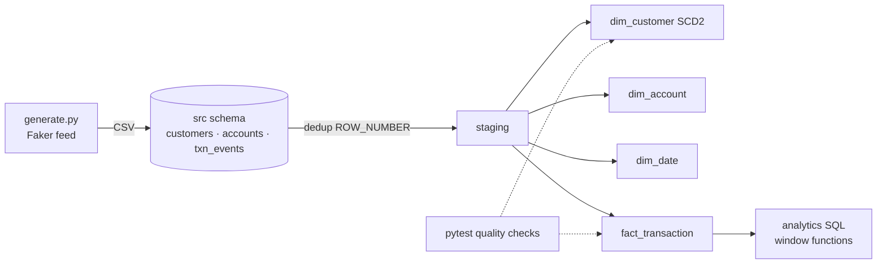

# Banking Transactions Warehouse

A raw card-transaction feed (with resent events, bursts and dirty rows) modeled into a
PostgreSQL star schema with an SCD Type 2 customer dimension, loaded idempotently by a
Python ETL, and guarded by data-quality tests that run in CI.

> Mirrors: *"Engineered modular ETL/ELT pipeline design and data modeling with SQL and Python,
> structuring raw transaction, customer, and account records into clean, standardized datasets"*
> and *"Automated data-quality checks (schema, null, and range validation) within CI/CD pipelines."*

## Architecture



## Stack

| Piece | Why |
|---|---|
| PostgreSQL 16 | Real planner and `EXPLAIN ANALYZE`, `ON CONFLICT` upserts, window functions |
| Python 3.12 + psycopg 3 | Orchestration, timing and logging; the heavy lifting stays in SQL |
| Faker | Reproducible synthetic data with planted problems |
| pytest | Data-quality checks as tests, so CI fails on bad data |
| Docker Compose | One command to a clean database |
| GitHub Actions | Builds the warehouse from scratch and tests it on every push |

## Run it

```bash
cp .env.example .env
python -m venv .venv && source .venv/bin/activate
pip install -e ".[dev]"
make all          # up -> data -> source -> warehouse -> load -> test
make changes load-day2 test   # day-2 customer snapshot, SCD2 changes
```

## Design decisions

See [docs/decisions.md](docs/decisions.md).

## Data quality

_TODO (Day 4): table of every check, what it catches, and which planted problem proves it works._

## Results

_TODO (weekend): numbers from your own runs._

| Measure | Value |
|---|---|
| Source events / distinct transactions | |
| Rejected rows (null / negative) | |
| Day-1 load time | |
| Second run of day-1 load: rows changed | 0 |
| Query 4 (velocity) before index → after index | |

## At 100× scale

_TODO (weekend): what breaks first, and what you'd change (partitioning, incremental loads, moving to Spark/Snowflake)._

## Interview talking points

_TODO (weekend): three 30-second stories this repo lets you tell._
